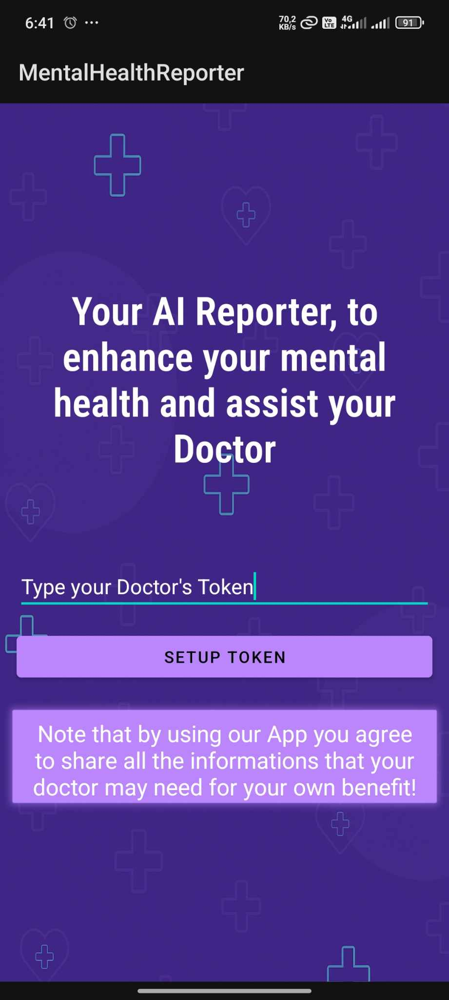
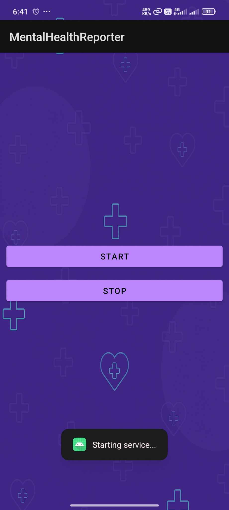

# Doctor Copilot

## Overview

**Doctor Copilot** is an AI-powered assistant designed to support **mental health professionals** by providing valuable insights into a patient’s digital behavior — **without the need for chatbot interaction or active check-ins**.

It passively collects data such as:
- App usage and screen time
- Visited websites and their categories
- Notifications and mental-health-related keywords

This data is analyzed to generate **summary reports**, **behavioral insights**, and **graphical charts**, helping doctors focus on **key behavioral indicators** and patterns for more effective consultation and diagnosis.

> **🔒 Privacy-first**: The system is designed with a strong emphasis on **data confidentiality**. While the current proof of concept performs analysis on a server (due to time constraints and integration complexity), our vision is to use [`llama.rn`](https://github.com/llama-rs/llama.rn) to run **AI agents directly on the mobile device**, ensuring all raw data stays local and only anonymized reports are sent to the doctor.


## Features

- ✅ One-time setup by the patient with permission approvals  
- ✅ Continuous passive data collection from the phone  
- ✅ Categorization of websites and apps used  
- ✅ Extraction of mental-health-related keywords from notifications  
- ✅ Summary report with actionable key points  
- ✅ Full report with behavior analysis  
- ✅ Visual charts to support understanding of behavioral patterns  


## System Components

### 📱 Mobile App

> A lightweight Android app installed on the patient's phone.

**Responsibilities**:
- Collects app usage time
- Tracks visited websites and classifies them
- Extracts notification keywords related to mental health

**Example of data collected** : 

**Tech Stack**: Java, Android Studio

**📸 Screenshots**:
- 
- 
- 


**🎥 Demo Video**:  
[Watch demo](./demo/mobile-demo.mkv)


### AI Backend (Proof of Concept)

> A Flask server using AI agents built with [CrewAI](https://docs.crewai.com/) to analyze collected data and generate structured reports.

**Responsibilities**:
- Process raw data
- Generate summary and full reports
- Extract trends and key topics
- Prepare data for dashboard visualizations

**Tech Stack**:
- Python
- Flask
- CrewAI
- Gemini API


### 💻 Doctor Dashboard

> A web dashboard for mental health specialists to manage patients, visualize behavioral data, and access generated reports.

**Responsibilities**:
- View patient summary and detailed reports
- Visualize behavioral trends with charts
- Manage patient profiles and appointment notes

**Tech Stack**:
- Next.js
- Tailwind CSS
- TypeScript

**📸 Screenshots**:
- 
- 

**🎥 Demo Video**:  
[Watch demo](#link-to-demo-video)

## 🔁 Workflow


## 🚀 Future Improvements

- [ ] Integrate `llama.rn` to run CrewAI agents directly on-device
- [ ] Encrypt local data and use secure enclave processing
- [ ] Implement real-time alerts for emergency behavior detection
- [ ] Add support for iOS via React Native


## 📁 Repository Structure

```
DoctorCopilot/
│
├— mobile-app/         # Android application
├— backend/            # Flask + CrewAI processing
├— dashboard/          # Next.js doctor interface
└— README.md
```


## 👥 Team Name: `CPU Team`

Made with ❤️ during AI wave– 2025.

